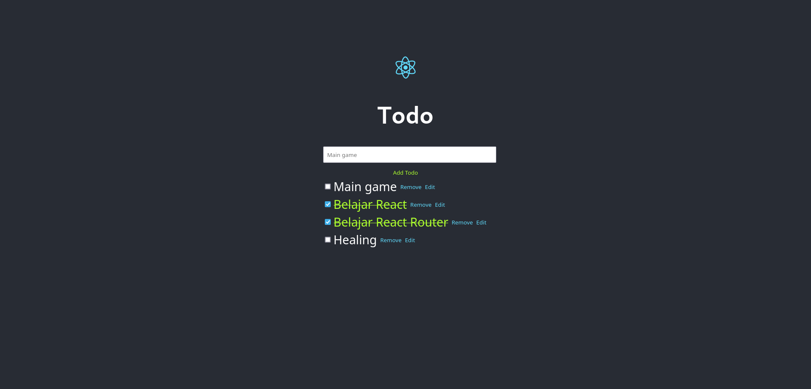

# Example React Todo Apps

This repository contains source code of https://fnurhidayat.github.io/react-todo, which is an application that will help you to organize your daily activities, kind of.

# How to run?

You can just simply clone this repository:

```sh
git clone https://github.com/fnurhidayat/react-todo.git
```

Then after you clone it, you need some of this binary on your machine:
- `npm` or `yarn`
- `nodejs`

If the requirement is already been fulfilled, you can just simply run this command to develop this repo:

```sh
npm run dev
```

# How to build?

This repository was generated by using `vite` and using `react` template of vite, to build this repo, it is very straight forward:

```
npm run build
```

Then your compiled code should lies under `dist` directory.

# Screenshots



# License

MIT